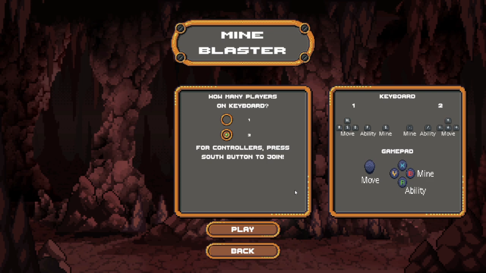

# Mine-Blasters
A local multiplayer 2D arena fighting game inspired by Nintendo Bomberman made with Unity (C#), focusing on fast-paced, replayable combat. It features procedural generation for arena layouts and weapon creation, combining weapon types (e.g. bombs, ranged) and elemental effects (e.g. fire) to create dynamic match experiences• It has support for gamepad controllers using engine’s new input system.

## Selelction Menu

## Match
